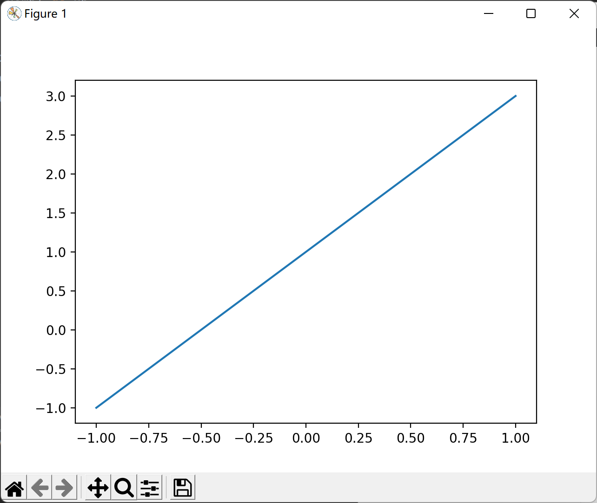

## 导入基本库

```python
import matplotlib.pyplot as plt
import numpy as np
```

其中matplotlib是用来画图的库，numpy是一个计算库。

## 二维画图

首先需要两个一一对应的点，比如一个x对应一个y。

```python
x = np.linspace(-1, 1, 50)
y = 2*x+1
```

上面的代码首先生成了一个x的numpy.ndarray数据类型，在-1到1的范围内取50个点，形成一个向量。

y由x计算得到，所以与x一一对应，也是50个点。

将他们交给plt.plot函数即可。

```python
plt.plot(x, y)
plt.show()
```

plot负责将图像画出来，show负责将图像展示在屏幕上。

最终效果如下：

